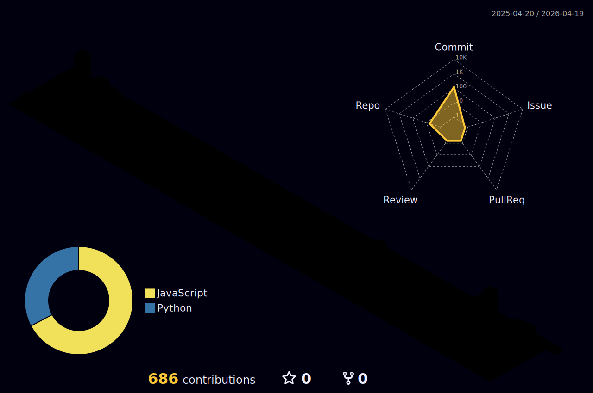

<!-- Profile README for Vishwaksen0124 -->

<div align="center">

<!-- Header -->


<!-- Typing Animation -->
<a href="https://github.com/Vishwaksen0124">
  
</a>

<br/>

<!-- Quick Stats Badges -->
<a href="https://github.com/Vishwaksen0124?tab=followers">
  
</a>


</div>

---

### About

```yaml
name: Pujala Vishwaksen
location: IIIT Sri City, India
education: B.Tech CSE (2022-2026)
current_focus:
  - Production-grade AI applications with LangGraph
  - Full-stack development (React, Next.js, FastAPI)
  - Cloud infrastructure (AWS, Terraform, Docker)
learning: Advanced AI agent architectures, system design
```

---

### Tech Stack

<table>
<tr>
<td width="50%" valign="top">

**Languages & Frameworks**


</td>
<td width="50%" valign="top">

**Cloud, Data & AI**


</td>
</tr>
</table>

---

### GitHub Analytics

<div align="center">


<br/><br/>


</div>

<br/>

<div align="center">
  
</div>

---

### 3D Contribution Map

<div align="center">
  
</div>

---

### Featured Projects

<div align="center">

<a href="https://github.com/Vishwaksen0124/Planity">
  
</a>
<a href="https://github.com/Vishwaksen0124/Customer-Segmentation">
  
</a>

<a href="https://github.com/Vishwaksen0124/Face-Detection">
  
</a>
<a href="https://github.com/Vishwaksen0124/Resume-Job-JD-analyzer">
  
</a>

</div>

---

### Achievements

<div align="center">
  
</div>

---

<div align="center">

[](https://github.com/Vishwaksen0124)
[](https://linkedin.com/in/vishwaksen)
[](mailto:vishwaksenpujala@gmail.com)

</div>


