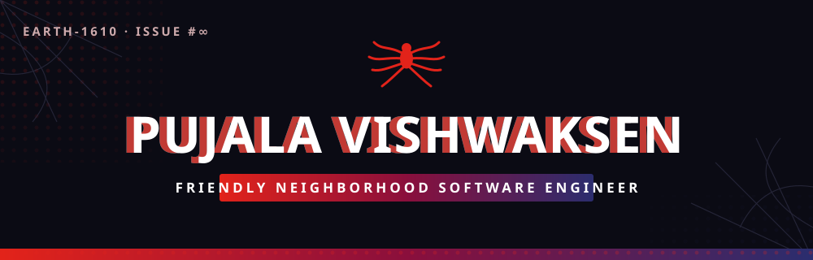

<!-- ╔══════════════════════════════════════════════════════════════╗ -->
<!--   Vishwaksen0124  ·  PROFILE README  ·  INTO THE SPIDER-VERSE    -->
<!-- ╚══════════════════════════════════════════════════════════════╝ -->

<div align="center">

<!-- ░░░ CUSTOM HERO BANNER (animated, self-hosted SVG) ░░░ -->


<!-- ░░░ TYPING — mission lines ░░░ -->
<a href="https://github.com/Vishwaksen0124">
  
</a>

<br/><br/>


<br/><br/>

<a href="https://linkedin.com/in/vishwaksenpujala"></a>
<a href="mailto:vishwaksenpujala@gmail.com"></a>
<a href="https://github.com/Vishwaksen0124"></a>
<br/>


</div>


```diff
@@ PANEL 01 — ORIGIN STORY @@
- not bitten by a radioactive spider
+ bitten by the production bug
```

> *"It's a leap of faith. That's all it is, Miles — a leap of faith."*

CS graduate from **IIIT Sri City** (CGPA **8.5/10**), now an **AI Engineer Intern @ Kookar AI**. I build backend and agentic-AI systems that swing through real traffic — **observable, retry-aware, and still standing** after the city throws everything at them.

```text
🕷️  NOW          backend · distributed pipelines · LangGraph agents
🧪  IN THE LAB    advanced agent architectures · evaluation · system design
🎯  ANSWERING     full-time Software Engineer / Backend / AI Engineer roles
📍  HOME TURF     Gurgaon, India  ·  somewhere across the Spider-Verse
```


```diff
@@ PANEL 02 — WITH GREAT POWER @@  (what I'm shipping at Kookar AI)
```

| 🦸 | **WhatsApp AI recruiting agent** | autonomously screened **500+ candidates** — 3 specialized LLM agents, human-in-the-loop approval, live React + Socket.IO dashboard |
|:--:|:--|:--|
| 🌐 | **Order-orchestration backbone** | powers **6 partner platforms @ 60+ orders/day** with retry-aware tracking, wallet debit & refund signaling |
| ⚡ | **Distributed async pipeline** | Celery + Redis + AWS EventBridge/SQS routing **thousands of events/day** across **20+ task types** — idempotency, backoff, dead-letter queues |
| 🧠 | **10+ LangGraph agents in prod** | Pydantic-typed, LangSmith-traced, evaluator configs grading live runs across OpenAI / Anthropic / Mistral |
| 📈 | **Northstar BI pipeline** | daily GMV / WAU / MAU / churn auto-emailed to founders + 4 Grafana dashboards |


```diff
@@ PANEL 03 — GADGETS & GEAR @@  (the web-shooters)
```

<div align="center">

**LANGUAGES**


**BACKEND & APIs**


**AI / LLM**


**DISTRIBUTED & CLOUD**


**DATA & FRONTEND**


</div>


```diff
@@ PANEL 04 — ACROSS THE SPIDER-VERSE @@  (featured builds)
```

<div align="center">

<a href="https://github.com/Vishwaksen0124/creative-writing-studio">
  
</a>
<a href="https://github.com/Vishwaksen0124/lovestream">
  
</a>

<a href="https://github.com/Vishwaksen0124/Planity">
  
</a>
<a href="https://github.com/Vishwaksen0124/image-stitching-rdisnet">
  
</a>

</div>

> 🕸️ **Creative Writing Studio** — multi-agent GenAI writing platform (LangChain + FAISS + Streamlit) · [Live](https://creativewritingstudio.streamlit.app)
> 🕸️ **LoveStream** — real-time WebRTC video & screen-share (Next.js 16 + Supabase Realtime)
> 🕸️ **Planity** — full-stack role-based task manager (React + Node + MongoDB + Redis + Docker)
> 🕸️ **RDISNet** — deep-learning image stitching with dilated residual encoders + transformer fusion


```diff
@@ PANEL 05 — SPIDER-SENSE @@  (the numbers don't lie)
```

<div align="center">


<br/><br/>


<br/><br/>


</div>


<div align="center">

### 🤝 LET'S TEAM UP

> *"Anyone can wear the mask. You could wear the mask."*

<a href="https://linkedin.com/in/vishwaksenpujala"></a>
<a href="mailto:vishwaksenpujala@gmail.com"></a>

<i>Open to full-time Software Engineer, Backend & AI Engineer roles — across every universe.</i>

</div>


