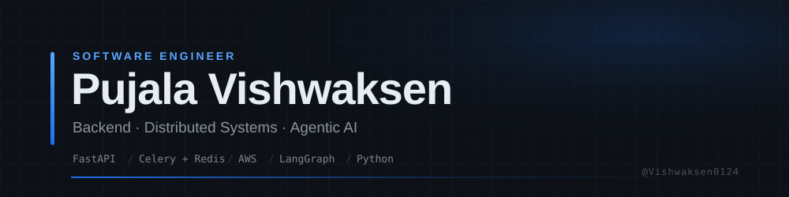

<!-- ╔══════════════════════════════════════════════════════════╗ -->
<!--   Vishwaksen0124 · Profile README                           -->
<!-- ╚══════════════════════════════════════════════════════════╝ -->

 

&nbsp;

 

## About

Computer Science graduate from **IIIT Sri City** (CGPA 8.5/10), currently an **AI Engineer Intern at Kookar AI**, where I build production backend services and agentic-AI systems. I focus on software that runs in production, stays observable, and holds up under real traffic.

- **Now:** Backend services, distributed pipelines, and LangGraph agents at Kookar AI
- **Interests:** Agent architectures, evaluation, and system design
- **Open to:** Full-time Software Engineer, Backend, and AI Engineer roles
- **Location:** Gurgaon, India

 

## Selected Work at Kookar AI

| Project | Impact |
|:--|:--|
| **WhatsApp AI recruiting agent** | Autonomously screened **500+ candidates** using 3 specialized LLM agents with human-in-the-loop approval and a live React + Socket.IO dashboard. |
| **Order-orchestration backbone** | Powers **6 partner platforms at 60+ orders/day** with retry-aware tracking, wallet debit, and refund signaling. |
| **Distributed async pipeline** | Celery + Redis + AWS EventBridge/SQS routing **thousands of events/day** across **20+ task types** with idempotency, backoff, and dead-letter queues. |
| **LangGraph agents in production** | **10+** Pydantic-typed, LangSmith-traced agents with evaluator configs grading live runs across OpenAI / Anthropic / Mistral. |
| **Northstar BI pipeline** | Daily GMV / WAU / MAU / churn metrics auto-emailed to founders, backed by 4 Grafana dashboards. |

 

## Tech Stack

**Languages** 

**Backend & APIs** 

**AI / LLM** 

**Distributed & Cloud** 

**Data & Frontend** 

 

## Featured Projects

- **Creative Writing Studio:** multi-agent GenAI writing platform (LangChain + FAISS + Streamlit) · [Live](https://creativewritingstudio.streamlit.app)
- **LoveStream:** real-time WebRTC video & screen-share (Next.js 16 + Supabase Realtime)
- **Planity:** full-stack role-based task manager (React + Node + MongoDB + Redis + Docker)
- **RDISNet:** deep-learning image stitching with dilated residual encoders + transformer fusion

 

## GitHub Stats

  

 

<i>Open to full-time Software Engineer, Backend, and AI Engineer roles.</i> 
<a href="https://linkedin.com/in/vishwaksenpujala">LinkedIn</a> · <a href="mailto:vishwaksenpujala@gmail.com">Email</a>

